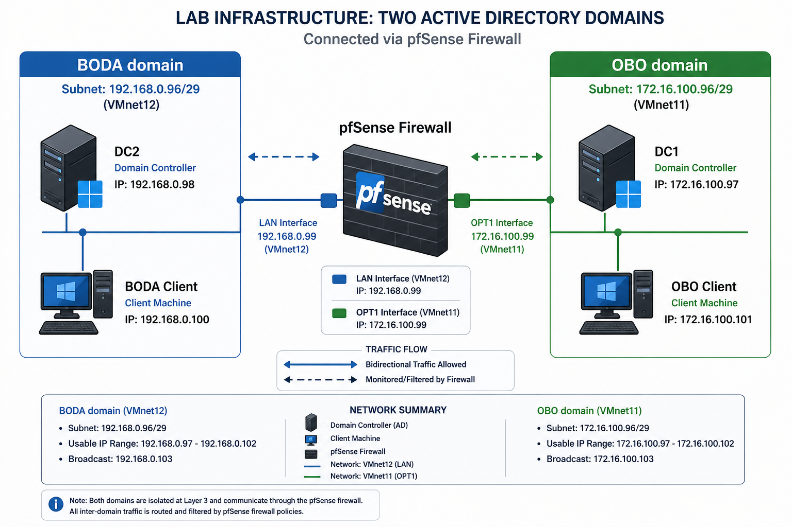
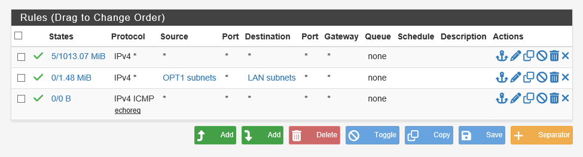
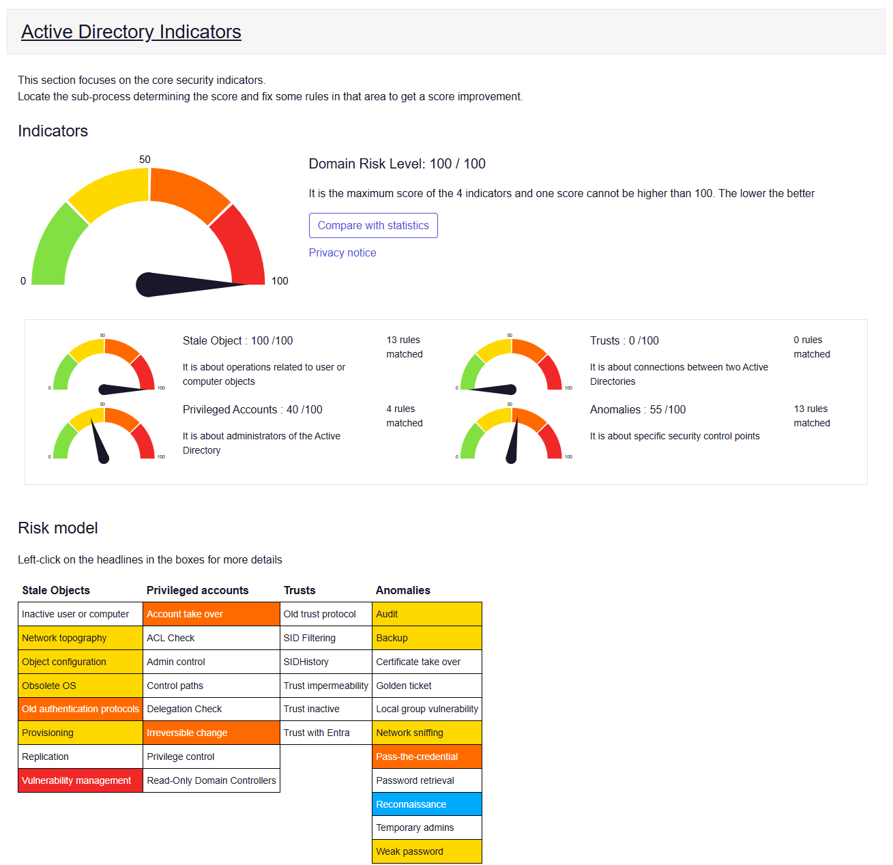

# 🏢 Interconnexion et sécurisation de deux domaines Active Directory

> Projet réalisé dans le cadre de la formation **TSSR – RNCP 37682** (COS Formation, 2024/2025)

Infrastructure Active Directory multi-sites déployée sous VMware, avec deux domaines distincts interconnectés via un pare-feu pfSense, gestion des accès AGDLP et audit de sécurité.

---

## 🗺️ Architecture

```
┌─────────────────────┐         ┌─────────────────────┐
│     Site BODA       │         │      Site OBO        │
│                     │         │                      │
│  DC-BODA            │         │  DC-OBO              │
│  bodaht.fr          │         │  oboht.fr            │
│  192.168.0.96/29    │         │  172.16.100.96/29    │
│                     │         │                      │
└────────┬────────────┘         └──────────┬───────────┘
         │                                 │
         │         ┌───────────┐           │
         └────────►│  pfSense  │◄──────────┘
                   │  Routeur  │
                   │  Firewall │
                   └─────┬─────┘
                         │
                       [WAN]
```



---

## 🛠️ Stack technique

| Composant | Rôle |
|-----------|------|
| Windows Server 2022 | Contrôleurs de domaine (x2) |
| Active Directory DS | Annuaire, authentification Kerberos |
| DNS (intégré AD) | Résolution de noms inter-domaines |
| pfSense | Routage inter-sites + pare-feu |
| VMware Workstation | Virtualisation de l'infrastructure |
| PingCastle | Audit de sécurité Active Directory |

---

## 📋 Ce que couvre ce projet

- **Déploiement AD** – Installation et promotion de deux contrôleurs de domaine sur des domaines distincts (`bodaht.fr` et `oboht.fr`)
- **Configuration réseau** – Adressage IP statique, segmentation par site, configuration des interfaces VMware
- **Routage pfSense** – Interconnexion des deux sites via interfaces LAN / OPT1 / WAN
- **Règles firewall** – Ouverture des flux nécessaires à AD (ICMP, DNS/53, Kerberos/88, LDAP/389, RPC...)
- **DNS inter-domaines** – Redirecteurs conditionnels croisés pour la résolution entre sites
- **Trust bidirectionnel** – Relation d'approbation entre les deux domaines AD
- **AGDLP** – Gestion des accès structurée : Account → Global Group → Domain Local → Permission
- **NTP** – Synchronisation temporelle hiérarchique (w32tm + pfSense)
- **Audit PingCastle** – Analyse des risques et identification des vulnérabilités de configuration

---

## 📸 Aperçu

### Trust Active Directory validé


### Règles firewall pfSense (interface OPT1)


### Résolution DNS croisée (nslookup)


### Audit PingCastle


---

## 📁 Contenu du repo

```
.
├── README.md
├── docs/
│   └── compte-rendu.docx        # Compte rendu détaillé (contexte, manips, problèmes, solutions)
├── screenshots/                 # Captures organisées dans l'ordre des manipulations
│   ├── 01-schema-reseau.png
│   ├── 02-promotion-dc.png
│   ├── 03-ipconfig-boda.png
│   ├── 03-ipconfig-obo.png
│   ├── 04-interfaces-pfsense.png
│   ├── 05-regles-firewall-opt1.png
│   ├── 06-redirecteurs-conditionnels.png
│   ├── 06-nslookup-croise.png
│   ├── 07-trust-valide.png
│   ├── 08-groupes-agdlp.png
│   ├── 08-permissions-ntfs.png
│   ├── 09-pingcastle-score.png
│   └── 10-w32tm-status.png
└── configs/
    └── pfsense-config.xml       # Export de la configuration pfSense (si disponible)
```

---

## 🧠 Ce que j'ai appris

- Le **DNS est la clé de voûte d'Active Directory** : toute erreur DNS bloque le trust, l'authentification et la réplication. On ne peut pas avancer sans le valider en premier.
- **pfSense applique un deny-all par défaut** : il faut ouvrir les flux service par service et valider chaque règle progressivement — ça force une bonne compréhension des ports utilisés par AD.
- **L'interdépendance des services** est la vraie difficulté : réseau, DNS, Kerberos et NTP doivent tous fonctionner ensemble. Un seul composant défaillant peut casser quelque chose d'apparemment sans rapport.
- **PingCastle révèle que la configuration par défaut n'est pas sécurisée** : un environnement qui "fonctionne" n'est pas forcément un environnement sûr.

---

## 👤 Auteur

**HT** – Candidat TSSR (Technicien Supérieur Systèmes et Réseaux)  
Formation en alternance à distance – COS Formation  
[LinkedIn](#) | [GitHub](#)

---

*Projet réalisé en environnement de lab VMware à des fins pédagogiques.*
